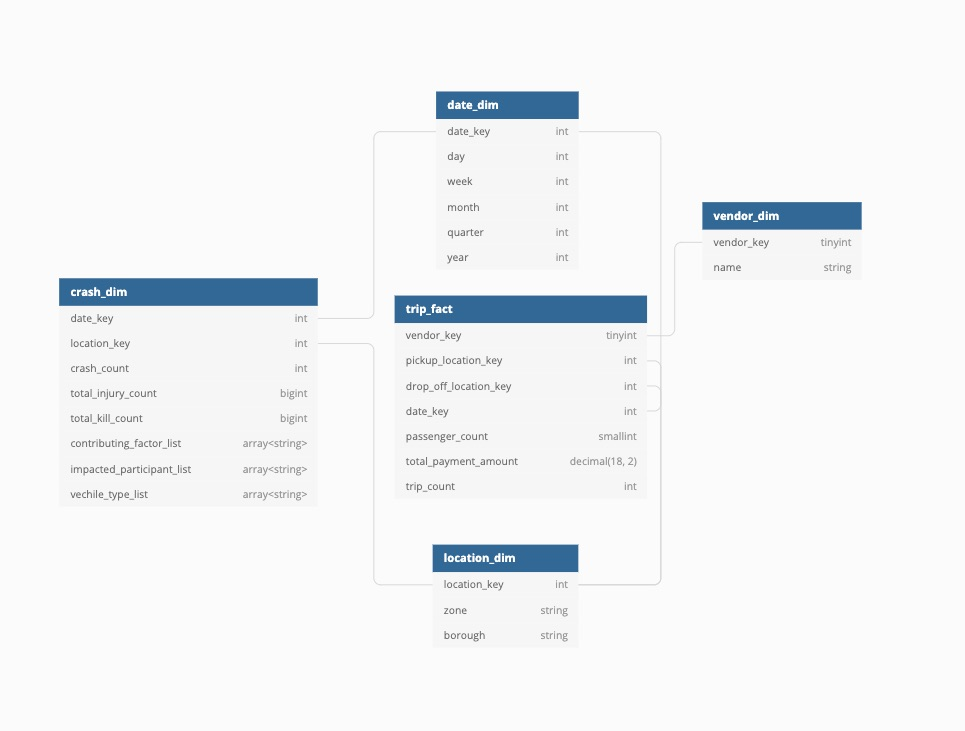
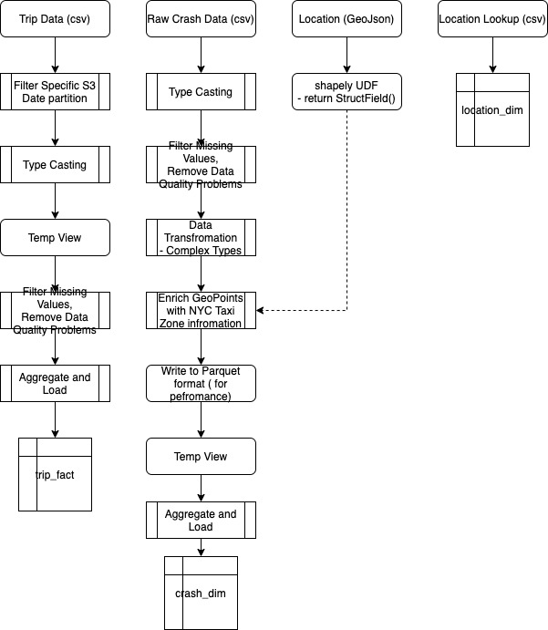

# Data Engineering Capstone Project


## Project Summary

The goal of this project is to build an ETL pipeline to construct reporting data model of NYC Taxi trips and traffic accidents.

The reporting structure is suited for daily view and analytical dashboards.It supports ad-hoc queries to help relate taxi traffic and traffic accidents in New York City. A business user will be able to explore relationships between traffic accidents and taxi revenue in NYC.

# Step 1: Scope the Project and Gather Data


## Project structure

- [etl.py](./spark/etl.py) - Contains fact-dimension etl pipeline
- [model.py](./spark/model.py) - Code to generate target data model and register in Hive metastore.
- [exploration.ipynb](./spark/exploration.ipynb) - Raw data exploration and data quality check notebook.
- [analytics.ipynb](./spark/analytics.ipynb) - Target data model quality checks and sample analytics queries.
- [helpers.py](./spark/helpers.py) - helper udf and sequence generators


## Project Datasets
1) [ New York City Taxi and Limousine Commision (TLC) Trip Record Data](https://registry.opendata.aws/nyc-tlc-trip-records-pds/)
   - Source Format: `CSV`
   - Update Frequency: Monthly
   - Description: Data of trips taken by taxis and for-hire vehicles in New York City. 
   - Each row: Represents a trip
2) [Motor Vehicle Collisions - Crashes](https://data.cityofnewyork.us/Public-Safety/Motor-Vehicle-Collisions-Crashes/h9gi-nx95)
    - Source Format: `CSV`
    - Update Frequency: Daily
    - Description: Contain information from all police reported motor vehicle collisions in New York City. The police report (MV104-AN) is required to be filled out for collisions where someone is injured or killed, or where there is at least $1000 worth of damage.
    - Each Row: Represents a crash event
3) [NYC Taxi Zones](https://data.cityofnewyork.us/Transportation/NYC-Taxi-Zones/d3c5-ddgc)
   - Source Format: `GeoJSON` 
   - Source Format: `CSV`
   - Update Frequency: Once
   - Description: Zones are roughly based on NYC Department of City Planning's Neighborhood Tabulation Areas (NTAs) and are meant to approximate neighborhoods.


## Project Scope

1) Use Apache Spark for ETL and Analytics Queries
2) Exploratory analysis of TLC Trip Record Data, missing value strategy, data cleaning.
3) Exploratory analysis of NYC Motor Vehicle Crashes Data, missing value strategy, data cleaning.
4) Create Spark UDF to classify Taxi Zone location of vehicle accidents. (Using shapely library)
5) Create date dimension generator using sequence range
6) Use Spark SQL to populate dimensional data model
7) Sample reporting queries in the [Analytics Notebook](./spark/analytics.ipynb)


# Step 2:  Explore and Assess the Data

Please refer to the [Exploration Notebook](./spark/exploration.ipynb) 

#  Step 3: Define the Data Model

## 3.1 Conceptual Data Model



The dimensional model is well suited for performant analytical queries. The primary goal was to identify common dimensions between two large datasets and create fact-dimension table structure is suitable for daily reporting. 

`trip_fact` - Contains aggregate information about trips, count and payments at a daily grain. This is a fact table, since it has a `total_payment_amount` measure value, which is useful for BI queries.

`crash_dim` - Contains aggregate information about traffic accidents, injuries and factors associated with the traffic accidents. 

`date_dim` - Common date dimension

`vendor_dim` - Taxi vendor metadata

`location_dim` - NYC Taxi Zone metadata

During a creation of this dimensional model I evaluated 2 options: 1) A normalized "snowflake" model 2) A denormalized "star" model. 

  The goal was to minimize the join depth between fact table and dimension table, thus I choose to go with a complex data types, which meant denormalizing `crash_dim` table. Spark and query engines such as AWS Athena and Apache Presto support complex data types, such as structs, maps and arrays. By leveraging array types, I am able to reduce the row count in the `crash_dim` table, all while maintaining a complete column cardinality and keeping reporting flexibility. 

  The target tables are stored in the parquet format which enables partition pruning (on partitioned tables) and efficient filter pushdown.


## 3.2 Mapping Out Data Pipelines




# Step 4: Run Pipelines to Model the Data 

## Setup

Configure `dwh.cfg` to suit your needs

```
cp ./dwh.example.cfg ./dwh.cfg
```

If GEO_CACHE=0 the etl pipeline will run a lengthy geo location identification and cache the results for fast future usage.

### Python

```
pip install shapely

```


## 4.1: Create the data model

```
spark-submit etl.py create_model project6-final/etl.cfg project6-final/sql/reporting.sql
```

## 4.2: Running the ETL pipeline

```
spark-submit etl.py project6-final/etl.cfg 
```

## EMR

You can leverage `project6-final/aws/emr_single_node.yml`

Create EMR
```
aws cloudformation create-stack --stack-name emr --template-body ./emr_single_node.yml

aws s3 cp project6-final/spark/etl.py s3://<your_bucket>

spark-submit s3://<your_bucket>/etl.py s3://<your_bucket>/<your_config_file>.cfg
```

Download sample data 

```
aws s3 cp s3://nyc-tlc/trip\ data/yellow_tripdata_2016-07.csv yellow_tripdata_2016-07.csv --no-sign-request
```


## 4.3: Data dictionary


### trip_fact

|     |   |
|-----|---|
| Table |  trip_fact |
| Format |  `Parquet` |
| Update Frequency  | Monthly  |
| Description| Aggregate trips grouped by vendor, date, pickup location and drop-off location|
| Each Row| Aggregated based on PK

|col_name             |data_type    |comment|
|---------------------|-------------|-------|
|vendor_key           |int          |null   |
|pickup_location_key  |int          |Taxi zone where the passenger was picked up   |
|drop_off_location_key|int          |Taxi zone where the passenger was dropped up   |
|date_key             |int          |null   |
|passenger_count      |int          | total number of passengers transported   |
|total_payment_amount |decimal(18,2)|total payment amount received from a passenger for a trip   |
|trip_count           |int          | total number of trips  |


### crash_dim


|     |   |
|-----|---|
| Table |  crash_dim |
| Format |  `Parquet` |
| Update Frequency  | Daily |
| Description| Aggregate crashes grouped by date, location|
| Each Row| Unique Day


|col_name                 |data_type    |comment|
|-------------------------|-------------|-------|
|date_key                 |int          |null   |
|location_key             |int          |null   |
|crash_count              |bigint       |Total number of crashes   |
|person_injury_count      |bigint       |Total number of persons injured   |
|person_kill_count        |bigint       |Total number of persons killed   |
|contributing_factor_list |array\<string>|All factors contributing to the accident, e.g speeding, running the stop sign etc.   |
|impacted_participant_list|array\<string>| Impacted participant classification such as pedestrian, motorist or cyclist  |
|vehicle_type_list        |array\<string>| Vehicle classification such as sedan, truck, taxi etc.  |


### date_dim

|     |   |
|-----|---|
| Table |  date_dim |
| Format |  `Parquet` |
| Update Frequency  | Once/On-demand  |
| Description| Common date dimension|
| Each Row| Unique Day


|col_name|data_type|comment|
|--------|---------|-------|
|date_key|      int|   Date integer SK derived from date type|
|     day|  tinyint|   null|
|    week|  tinyint|   null|
|   month|  tinyint|   null|
| quarter|  tinyint|   null|
|    year|      int|   null|


### location_dim

|     |   |
|-----|---|
| Table |  location_dim |
| Format |  `Parquet` |
| Update Frequency  | Once/On-demand  |
| Description| NYC taxi zone locations |
| Each Row| Unique NYC Taxi Zone Location |


|col_name    |data_type|comment|
|------------|---------|-------|
|location_key|int      | location identifier   |
|zone        |string   | roughly comparable to a neighborhood   |
|borough     |string   | NYC borough, such as Bronx, Manhattan, Queens  |


### vendor_dim


|     |   |
|-----|---|
| Table |  vendor_dim |
| Format |  `Parquet` |
| Update Frequency  | Once/On-demand  |
| Description| NYC Taxi vendor enumeration |
| Each Row| Unique Taxi vendor|

|col_name  |data_type|comment|
|----------|---------|-------|
|vendor_key|tinyint  |null   |
|name      |string   |Taxi vendor name   |


# Step 5: Complete Project Write Up

## Technologies 

NYC trip data is an example of the big-data datasets. The full dataset is 296.9GB (As of 11/15/2020) in size. Because the dataset can't be read into memory completely on the conventional machine, we have to rely on the distributed data processing frameworks such as Apache Spark to process data. Apache Spark offers convenient and unified API to processing data. It stands out due to it's ability to process large quantities of data using SQL or interchangeably with SQL compatible programmatic DSL in Python, Java or Scala. 

## How often data should be updated 

Datasets have various update frequencies driven by the source systems. `trip_fact` table can be scheduled to be updated monthly. `crash_dim` can be updated daily. Other dim tables can be updated once or on-demand. 

## How you would approach the problem differently under the following scenarios:

- ###  The data was increased by 100x
  
  Provision a larger number of compute nodes, to better parallelize data processing. Consider creating highly optimized and compressed staging tables for example in Parquet or ORC format to rely on partition pruning and more efficient file scanner. Columnar store and compression will enable faster reads and lower storage footprint.

- ### The data populates a dashboard that must be updated on a daily basis by 7am every day.
   Partition the target dataset so that minimal number of partitions is touched during ETL. This will ensure that only required partitions will be scanned and make data refresh faster. ETL pipelines can be scheduled to run using a scheduler such as CRON or job flow automation framework such as Apache Airflow.
- ### The database needed to be accessed by 100+ people.
   Using cloud vendor managed query engine such as AWS Athena, Google Big Query and Amazon Redshift can not only simplify DevOps burden but also enable scaling to a 100+ people.

